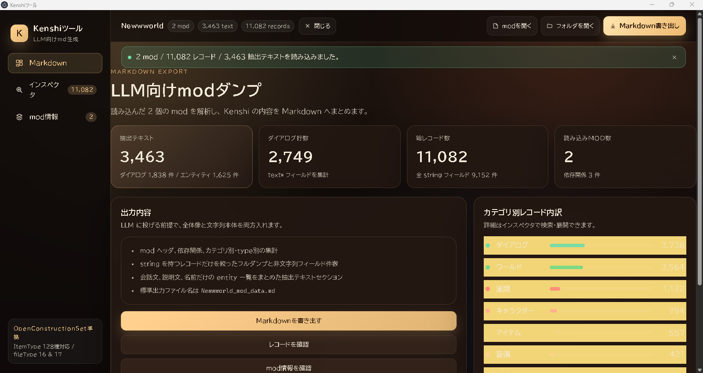
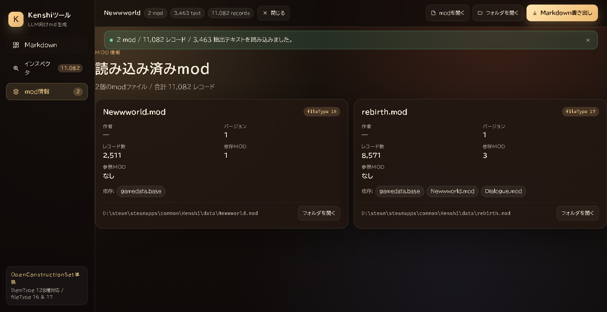

# kongyo-kenshi-tool

Kenshi の `.mod` を解析し、LLM に渡しやすい Markdown に変換する Electron + React 製デスクトップツールです。

## スクリーンショット





## 主な機能

- `.mod` ファイル / mod フォルダの読み込み（選択ダイアログ・ドラッグ&ドロップ対応）
- 読み込んだ mod のメタ情報（名前・著者・依存関係など）の確認
- インスペクタによるレコード一覧・検索
- 参照フォルダ（バニラデータや前提 mod など）を指定して、解析時のコンテキストレコードとして利用
- 解析結果を LLM 向けに整形した Markdown としてエクスポート

## 動作環境

- Windows（配布物は Windows 用ポータブル実行ファイル）
- 開発時は Node.js `^20.19.0 || >=22.12.0`

## 使い方

1. アプリを起動する。
2. 「modを開く」または「フォルダを開く」から `.mod` ファイルや mod フォルダを指定する。ウィンドウへのドラッグ&ドロップでも読み込み可能。
3. 必要に応じて「参照フォルダ」からバニラデータや前提 mod を指定する。次回以降の読み込みでコンテキストレコードとして参照される。
4. 「Markdown書き出し」で解析結果を `.md` として保存する。
5. サイドバーの「インスペクタ」「mod情報」から、レコードや mod メタ情報を確認できる。

## 開発

```bash
npm install
npm run dev        # Vite + Electron の開発起動
npm run typecheck  # TypeScript の型チェック
npm run lint       # oxlint
npm run check      # typecheck + lint:strict + build
```

## ビルド

Windows 用ポータブル実行ファイルを生成します。

```bash
npm run dist
```

成果物は `release/` 以下に出力されます。

## ディレクトリ構成

- `electron/` — Electron のメインプロセス / preload
- `src/` — React レンダラ
  - `views/` — Markdown / インスペクタ / mod情報 の各画面
  - `components/` — サイドバーやローダーなどの UI 部品
  - `lib/` — 集計などのロジック
  - `shared/` — メイン・レンダラ間で共有する型と mod 解析・Markdown 生成
- `docs/screenshots/` — README 用スクリーンショット

## ライセンス

[MIT License](LICENSE)
